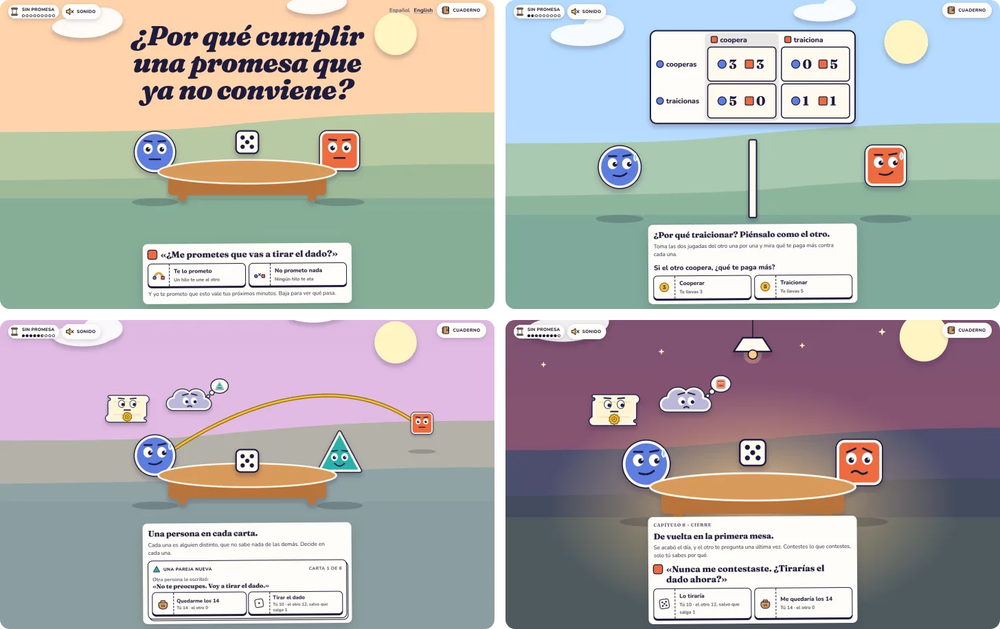

# ¿Por qué cumplir una promesa que ya no conviene?

[English](README.md)

**[Abrir el sitio](https://montse2308.github.io/why-keep-a-promise/es/)**



La página de divulgación de un proyecto personal de investigación sobre por qué la gente cumple
promesas que ya no le convienen. El home abre con una portada con una puerta a cada parte de la
página y sigue con una historia ilustrada corta que avanza con el scroll, en nueve capítulos, del dilema del
prisionero al juego de cambio de pareja de Vanberg (2008), y un cuaderno a un toque de distancia
guarda la profundidad.

## Lo que vale la pena ver

- **Primero, un storyboard.** Cada página es HTML estático. Sin JavaScript, el home es un
  storyboard: cada capítulo un cuadro quieto con sus textos, cada resultado por escrito. Un script
  lo pone a moverse con el scroll nativo, que nunca captura.
- **Un motor de escenas propio.** Pistas, suavizado, colores mezclados en OKLCH y una cámara que
  encuadra cada pantalla, escritos en TypeScript para esta historia: módulos puros con sus pruebas,
  sin librería de animación y sin canvas.
- **Un candado fuera del build.** Una parte del sitio sigue cerrada hasta que el
  [documento de trabajo (*working paper*)](https://papers.ssrn.com/sol3/papers.cfm?abstract_id=7580218)
  sea público en SSRN. Esa parte se queda
  fuera del build, no escondida, y `npm run verify:dist` lee cada archivo construido y falla si se
  coló algún rastro.
- **Presupuestos y pruebas que detienen el build.** CI falla si el JavaScript del home pasa de
  40 KiB comprimido, las fuentes de 160 KiB o la primera carga de cualquier página de 450 KiB. Más
  de 1200 pruebas mantienen los pagos como fracciones exactas, cada cifra atada a su fuente y el
  inglés y el español a la par.

La página cuenta cómo está hecha en
[Cómo está hecho](https://montse2308.github.io/why-keep-a-promise/es/how-its-built/).

## Correrlo en local

Requiere la versión de Node.js de [`.nvmrc`](.nvmrc).

```sh
npm ci
npm run dev      # http://localhost:4321/why-keep-a-promise/
npm run check    # astro check + tsc
npm test         # vitest
npm run build    # sitio estático en dist/
npm run verify:dist  # nada bloqueado llegó a dist/
npm run budgets      # cada página dentro de su presupuesto de peso
```

Hecho con Astro, TypeScript y SVG. Inglés en `/`, español en `/es/`.

## Licencia

[MIT](LICENSE)
